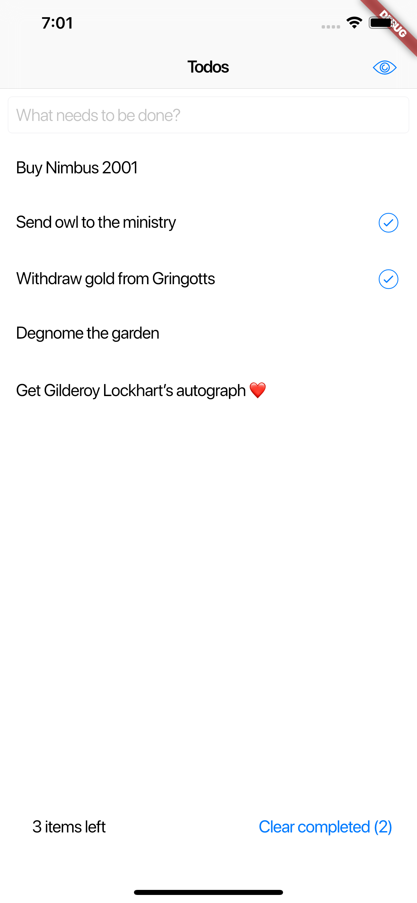
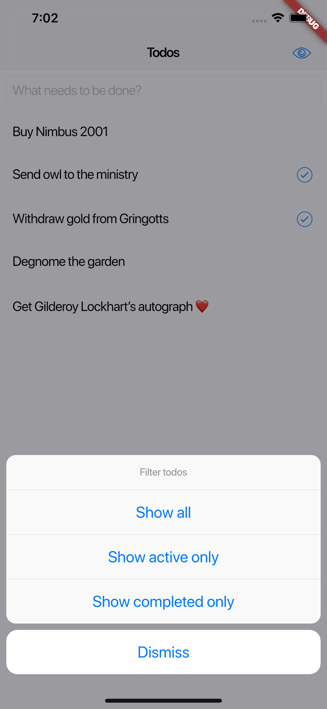
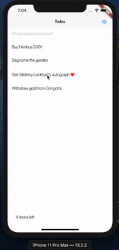

# todo_mvc

Good ol' Todo MVC but this time it's a mobile app made with Flutter 🤓

Todo list | Filters
--------- | -------
 | 

## Swipe to dismiss ##

I wanted to implement a swipe to dismiss for my todos, turns out the `Dismissible` widget does all the heavy lifting for you 👍🏻

## What I used for this ##

Let's make a list of all the libraries, patterns and nice stuff I wanna show off of this endeavour:

- BloC pattern implemented using the libraries `bloc` and `flutter_bloc`
- No synchronization with any backend - wanted to make it simple
- Made all my model classes immutable and did not use `equatable` on purpose, I wanted to work with referential equality
- `get_it` for some pseudo dependency injection - this way all my services and blocs are proper singletons and I can decouple interfaces and implementations whenever I choose to do that
